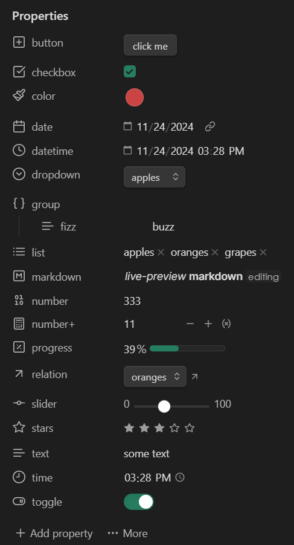
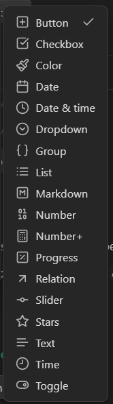
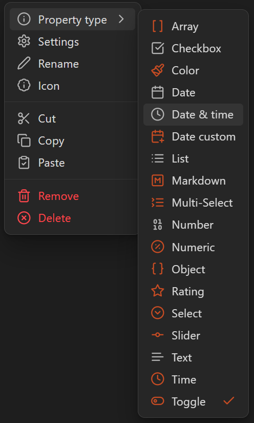

> [!WARNING]
> 🚧 **UNDER CONSTRUCTION** 🚧
>
> This plugin is not yet intended to be used by others.
>
> But if you _really_ want to anyway, just be aware that there may be breaking changes that may require you to reconfigure different features and settings.

# Better Properties

What if Properties in Obsidian were... better?

This plugin adds many different properties-related features, such as new property types and per-property settings.

- [[#Installation]]
- [[#Contributing]]
- [[#Docs]]
- [[#Features]]

<!-- 

 -->

## Installation

> [!CAUTION]
>
> **DISCLAIMER**
>
> This plugin makes heavy use of the _undocumented Obsidian API_ and uses a few _monkey-patches_ around existing app functions.
>
> Because of the above, this plugin is prone to unforeseen, breaking changes on new updates to the Obsidian application.
>
> If you use this plugin, I would recommend you _turn off_ automatic updates for Obsidian _or_ be prepared to open bug reports and/or wait for fixes

1. Coming soon to a BRAT near you!

## Contributing

- Bugs, feature requests, questions-- [Open an issue!](https://github.com/unxok/obsidian-better-properties/issues/new/choose)
- Pull requests-- likely won't be accepted at this time as the plugin is still in very early stages
- Translations-- _instructions TBD_

## Docs

My goal is to not _need_ to create official documentation for the features of this plugin. If needed, I may add additional help text to different settings or modals as needed. Please [open an issue](https://github.com/unxok/obsidian-better-properties/issues/new/choose) if you notice something that needs better documentation, whether within obsidian or not.

## Features

### Additional property types

**note:** Types that have a reserved keyword are marked with an asterisk (\*)

- [ ] Background
- [ ] Banner
- [ ] Button
- [ ] Calculation
- [x] Color
- [ ] Custom
- [x] Created\*
- [ ] Date Custom
  - [Properties: let the user customize the way Dates/Times are displayed (independently from OS)](https://forum.obsidian.md/t/properties-let-the-user-customize-the-way-dates-times-are-displayed-independently-from-os/64139/108)
  - [Date & time property type doesn’t display or edit seconds](https://forum.obsidian.md/t/date-time-property-type-doesnt-display-or-edit-seconds/104154/3)
- [ ] Date Range `NOT COMMITED`
  - You can achieve this with a "group" type and sub-properties name like "from" and "to", so I'm unsure if there's a strong need for this.
- [x] Dropdown
- [x] Group
- [ ] Image
  - [New property type: media](https://forum.obsidian.md/t/new-property-type-media/99259/1)
- [x] Markdown
  - [Properties & Bases: Parse (Render) Markdown in text properties // Allow mixing text and links in string fields](https://forum.obsidian.md/t/properties-bases-parse-render-markdown-in-text-properties-allow-mixing-text-and-links-in-string-fields/66542/18)
- [ ] Modified
- [ ] Multiselect `NOT COMMITED`
  - You can achieve this with a "list" type and custom suggestions, so is there enough of a need to have a dedicated "multiselect" type as well?
- [ ] Progress
- [ ] Relation
  - [Add support for automatic, bidirectional and separately named list properties](https://forum.obsidian.md/t/add-support-for-automatic-bidirectional-and-separately-named-list-properties/76175/4)
- [x] Select
- [ ] Slider
- [ ] Rating
- [ ] Tags Category
  - [Add a property type for tags / multiple tag-based properties](https://forum.obsidian.md/t/add-a-property-type-for-tags-multiple-tag-based-properties/63810/15)
  - [Properties: Recognize tags in text property when formatted as “#tags”](https://forum.obsidian.md/t/properties-recognize-tags-in-text-property-when-formatted-as-tags/63812/40)
- [ ] Time
- [x] Title\*
- [x] Toggle

### Metadata (frontmatter) Editor

- [x] Resizable, draggable property label width
- [x] Hidden properties
  - [Toggle visibility of/hide specific properties](https://forum.obsidian.md/t/toggle-visibility-of-hide-specific-properties/64948)
- [ ] _More_ button
  - [x] Toggle showing hidden properties
  - [x] Sort properties
  - [ ] Synchronize with template

### Property editor

- [ ] property menu
  - [ ] Property type
    - [x] Distinguish custom from built-in
    - [ ] Option to separately group custom from built-in
  - [x] Open property settings
  - [x] Rename property
    - [Rename a property value across all notes](https://forum.obsidian.md/t/rename-a-property-value-across-all-notes/101275/13)
  - [x] Change icon
  - [ ] Other notes with this property
    - [Show Note Count Next to Property Values in Frontmatter](https://forum.obsidian.md/t/show-note-count-next-to-property-values-in-frontmatter/94606/1)
  - [x] Delete property from all notes
- [x] property aliase option
- [x] custom icon option
- [x] default value option
- [x] custom suggestions option
  - [Customizable Property Suggestions Lists](https://forum.obsidian.md/t/customizable-property-suggestions-lists/105142/7)
- [ ] loader function option
- [ ] Save properties section fold state to property
  - [Is it possible to set Properties to be collapsed/folded by default?](https://forum.obsidian.md/t/is-it-possible-to-set-properties-to-be-collapsed-folded-by-default/78060)

### Commands

- [x] Open property settings
- [x] Refresh all Metadata Editors
- [x] Rebuild all views

### Miscellaneous

- [x] Option to disable chosen property types
- [ ] Option to modify default icon for chosen property types
- [ ] Full link-recognition in property values
- [ ] Render property within note content as codeblock or inline-codeblock
